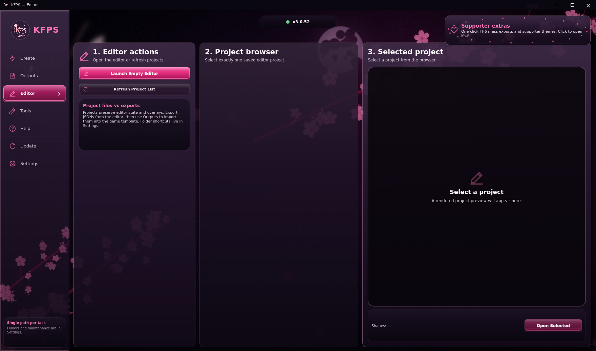
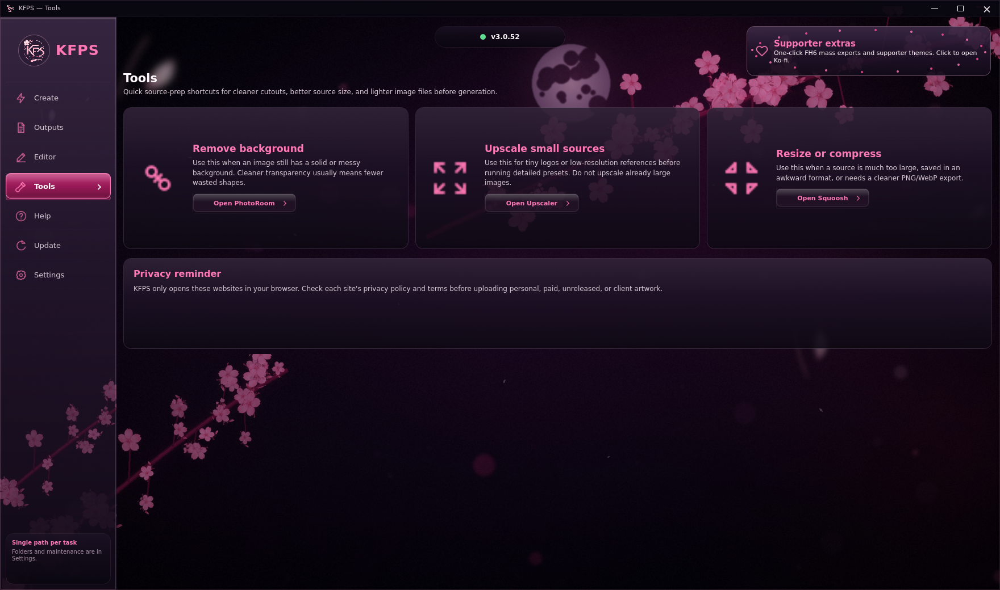
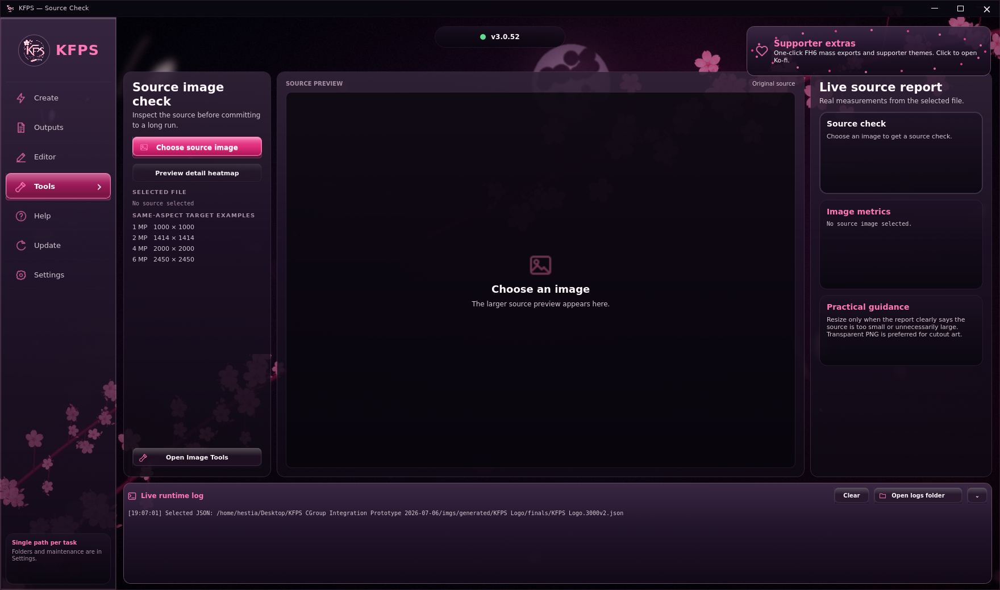

# KFPS - Kloudy's Forza Painter Suite

## **IMPORTANT UPDATE NOTE FOR VERSIONS BELOW 2.0.10**

**If you are on any version below `2.0.10` and the launcher does not open, do not keep clicking the launcher.**

**Open the `KloudysFH6Painter` folder and run `03_update_from_github.bat` instead.**

**After the update finishes, use the launcher normally again. New downloads from `2.0.10` onward already include the fixed launcher.**

<p align="center">
  
</p>

[English](README.md) | [中文](README.zh-CN.md)

> **NEWS: KFPS now has a cleaner native Outputs workflow and supporter-unlocked offline save-library tools.**
>
> Generated finals, editor exports, game exports, and scanned save-library JSONs are now handled from one thumbnail-first Outputs view. FH6 remains the main target; offline save-library work is still experimental and intentionally gated while it is tested more widely.

KFPS is a Windows-focused Forza Horizon 6 vinyl suite with a native QML app. It can generate vinyl JSON from source art, finalize and preview import-ready checkpoints, import compatible JSON through the FH6 importer, export compatible game JSON, scan supported Forza save-library layer groups, and launch the bundled editor for manual vinyl work.

This page is the start-here guide. The full user manual is in [docs/USER_MANUAL.md](docs/USER_MANUAL.md), and the detailed FH6 template/import guide is in [docs/FH6_IMPORT_GUIDE.md](docs/FH6_IMPORT_GUIDE.md).

## What KFPS Includes

| Feature | What it does |
| --- | --- |
| `Create` | Converts PNG/JPG source art into finalized FH6 vinyl JSON using the bundled GPU generator, source checks, presets, and KFPS finalization pipeline. |
| `Outputs` | Shows generated finals, editor exports, game exports, and save-library JSONs as thumbnails with previews, layer counts, import controls, and export controls. |
| `Online Import / Export` | Imports compatible JSON into a prepared FH6 vinyl template and exports the currently loaded editable group through the live game locator. |
| `Offline Save Library` | Supporter-unlocked WIP tools for scanning supported Forza save folders, building local JSON previews, and testing save-folder based workflows. |
| `Editor` | Launches the bundled Fabric-based JSON editor for manual vinyl creation, cleanup, tracing, shape search, favorites, color picking, layer work, guide snapping, and JSON export. |
| `Tools` | Collects useful prep links for background removal, browser upscaling, and browser downscaling/compression. |
| `Help / Reports / Update` | Built-in workflow guide, local bug/suggestion reports, GitHub version checks, and updater entrypoint. |

## Optional Ko-fi

KFPS is free, and support is completely optional. If the suite saved you time and you feel like leaving a tiny tip, it would make me very happy and helps with testing time, assets, and maybe someday a proper little logo or mascot.

https://ko-fi.com/O7O020EQNQ

## Supporter Key Activation

A valid supporter key registers automatically to one Windows device the first time KFPS finds it. The one-time HTTPS request contains only an opaque key identifier, proof that the signed key is genuine, a random device token, and a request nonce. It does not send the supporter's name, email, Windows account, hardware serial numbers, artwork, or file paths.

After registration, KFPS protects a permanent local receipt with Windows protected storage and does not require recurring activation checks. Use `Settings > Release Device` before moving the key to another computer. If a copied key is already registered elsewhere, public KFPS features remain available and the app shows a support code for reset assistance.

## Why It Is Useful

- One standalone folder can handle updates, generation, previews, imports, exports, library scans, and manual JSON editing from the native app.
- Generated runs keep raw checkpoints, final checkpoints, previews, reports, and metadata in predictable folders.
- The Outputs view focuses on import-ready JSONs instead of making users dig through raw generator output.
- Source-aware settings keep normal generation simple while still allowing Pro settings for manual tuning.
- FH6 imports use a reusable 3000-layer plain white circle template, then cull the saved layer count down to the imported design.
- The editor is local/offline, so manual shape work can be done outside the in-game editor.
- The source checks and tool links make image preparation part of the same workflow instead of a separate guessing step.

## Manual Editor Highlight

KFPS includes a native Editor tab plus a bundled local Fabric editor for people who want to manually build, repair, trace, or clean up FH6 JSON instead of relying only on automatic generation.

<p align="center">
  
</p>

The editor is designed around practical vinyl work:

- Load generated, exported, or hand-edited JSON and inspect it visually.
- Add FH6 shapes from a searchable in-game-style shape library.
- Favorite common shapes so they stay easy to reach.
- Add a source image overlay for tracing and adjust overlay opacity/size.
- Sample colors from the overlay or existing shapes instead of guessing RGB values.
- Select one layer, box-select many layers, group layers internally, hide/lock groups, duplicate, delete, and reorder.
- Move, stretch, skew, rotate, and nudge shapes with editor controls built for vinyl cleanup.
- Use guides and snapping for cleaner alignment work.
- Save editor projects separately from FH6 export JSON.
- Export JSON back into the KFPS import workflow.

## Community Contributions

A very, very big thank you to LanceMuscles for insights into the deep and almost forgotten lore of Forza Horizon image-to-vinyl generation.

Many more thanks to River, Elu, Wolfie, WKD_Will, Big Nut, Korinthian, Catinus, Soypoka, Slasher, Melon, Eddie, Frozander, Kuroshine, slaigh., Asayunon, and Astral_Cat for suggestions, testing, tips, and solutions.

Thank you to dcinside.com and minnn for the detailed guide coverage and feedback.

## Credits

This project builds on earlier Forza Painter work and keeps license notices in [LICENSE](LICENSE), [LICENSE.geometrize-gpu](LICENSE.geometrize-gpu), [LICENSE.custom-importer](LICENSE.custom-importer), and [LICENSE.fabricjs](LICENSE.fabricjs).

### Special Thanks: ForzaLiveryStudio

A particularly big thank you to [Arstz/ForzaLiveryStudio](https://github.com/Arstz/ForzaLiveryStudio) and everyone who worked on it. KFPS' offline save-library direction was informed by studying the public ForzaLiveryStudio project, especially its documented `C_group`, `C_livery`, header, and save-file-first approach. KFPS does not vendor ForzaLiveryStudio code; this is a direct credit for public research, documentation, and ideas that made the offline route clearer.

Additional ForzaLiveryStudio thanks:

- [Arstz](https://github.com/Arstz): project author/maintainer, C++/Qt editor work, proprietary Forza binary import/export direction, documentation, and overall architecture.
- [Fr4g3z](https://github.com/Fr4g3z): format reversing help and editor/tooling contributions including color sampling and quality-of-life work.
- [RPINerd](https://github.com/RPINerd): Linux build documentation and build-fix contributions.
- [Zloysvin](https://github.com/Zloysvin): README/project documentation work, shape naming, and upstream project support.
- Pengyss: non-uniform group transform algorithm credited by the upstream project.
- Mixbob: in-game testing and feedback credited by the upstream project.
- Eaterrius: resource/token support credited by the upstream project.
- Everyone whose liveries and vinyl groups helped decode the format.

| Person / project | Link | Contribution |
| --- | --- | --- |
| AE / A-Dawg#0001 | https://github.com/forza-painter/forza-painter | Original Forza Painter project, MIT-licensed import workflow, memory-writing/import foundation, and geometry-to-vinyl approach. |
| BVZRays / bvz rays | https://github.com/bvzrays/forza-painter-fh6 | FH6-focused desktop work, importer/locator behavior, UI/package workflow ideas, and upstream FH6 experimentation. |
| Arstz / ForzaLiveryStudio | https://github.com/Arstz/ForzaLiveryStudio | Public Forza save-format editor/research project whose documentation and save-file-first approach helped inform KFPS offline library work. |
| Fabric.js | https://fabricjs.com/ | Canvas editing library used by the bundled browser editor. |
| zjl88858 / forza-painter-geometrize-gpu | https://github.com/zjl88858/forza-painter-geometrize-gpu | GPU/OpenCL generator lineage used by the bundled generator workflow. |
| Community FH5 shape-code spreadsheet | https://docs.google.com/spreadsheets/d/1zmdme-c1ZqxTw8dd-ooYhJV8aOSYc1LkZlmIfELRbqo/edit#gid=0 | Shape-code ordering and names used as the starting point for FH6 registry work. |
| Frozander | Discord | Practical page/offset observations that helped validate FH6 shape registry inference. |
| Community testers | Discord | Templates, screenshots, crash reports, save/reload checks, and import validation. |
| Sam Twidale | https://samcodes.co.uk/ | `geometrize-lib` author; original geometry approximation work credited by upstream license notices. |
| Michael Fogleman | https://github.com/fogleman/primitive | `primitive` author; original primitive-based image approximation library credited by upstream license notices. |
| Sanguk Ko / ree9622 | https://github.com/ree9622 | Korean localization contributor in upstream history. |
| heyitshestia / Kloudy | https://github.com/heyitshestia/kloudys-forza-painter-suite | KFPS suite workflow, native QML app, presets, finalization, JSON browser, updater, packaging, FH6 safety adjustments, layer culling, editor integration, and FH6 handmade/import tooling. |

## Download

For normal use, download the latest release zip:

```text
KFPS-<version>-bundled.zip
```

The release should contain:

```text
KFPS.exe
Images/
KloudysFH6Painter/
```

The standalone release includes bundled Python 3.12, bundled Python dependencies, the current KFPS generator executable, the app files, the editor files, and update scripts. You should not need to install Python manually when using the full standalone release.

## First-Time Setup

1. Extract the release zip into a normal writable folder such as `Desktop`.
2. Open `KFPS.exe`.
3. Use Settings to verify the bundled runtime if the app reports a problem.
4. Open the `Update` tab only when the app says a newer version is available.
5. Start from the Create workflow buttons.

## Main Workflow

1. Put source art into the `Images/` folder next to `KFPS.exe`.
2. Open `KFPS.exe`.
3. Open `Create`.
4. Choose one or more source images.
5. Choose a preset.
6. Set `Template layers` to the FH6 template size you will import into.
7. Click `Generate vinyl`.
8. Wait until the log says `FINALIZE CHECKPOINTS COMPLETE`.
9. Open `Outputs`.
10. Select the finalized checkpoint you want from the thumbnail grid.
11. Open FH6, load your reusable 3000-layer plain white circle template, and ungroup it.
12. Click `Online import selected JSON`.

Generation is not finished when the generator process stops. The import-ready files are ready only after finalization completes.

<p align="center">
  
</p>

## FH6 Template Requirement

The recommended import base is a reusable 3000-layer plain white circle vinyl group.

Create it once:

1. Open FH6 Vinyl Group Editor.
2. Create or load a group containing 3000 simple white circle layers.
3. Save the group.
4. Leave the group editor.
5. Reopen the saved group.
6. Ungroup it before importing.

After that, reuse the same saved/reopened template. KFPS imports into the loaded template and culls the final layer count down to the design that was imported.

The detailed step-by-step version is in [docs/FH6_IMPORT_GUIDE.md](docs/FH6_IMPORT_GUIDE.md).

## Generate Final Vinyl

The generator turns source art into raw checkpoints, then KFPS finalizes those checkpoints into import-ready JSON.

Current stock presets are style-focused:

| Preset | Best for | Notes |
| --- | --- | --- |
| `Shaded Character Art` | anime, characters, hair, faces, mixed soft/hard detail | General default for detailed artwork. |
| `Flat Colors` | stickers, decals, clean color regions, mascot-style art | Prioritizes stronger edge separation and cleaner flat regions. |
| `Smooth Gradients` | soft lighting, glossy shading, blended colors | Keeps transitions smoother and avoids over-sharpening gradients. |

Normal users usually only need:

| Setting | Meaning |
| --- | --- |
| `Template layers` | The FH6 template layer count and target output budget. |
| `Finalize at layers` | Which checkpoints become final import choices, for example `500,1000,1250,1500,2000,2500,3000`. |

Pro settings expose resolution, random samples, mutated samples, source prep, and repair options. Use them when you want manual control, not for normal first runs.

### Source Size Prep

Before generating, use the source check in `Create` when you are unsure whether the source is too small or unnecessarily huge.

Source size matters:

- Very small images can lose detail before the generator ever sees it.
- Extremely large images can waste time, blur the useful search budget, and make runs slower without improving the final vinyl.
- The best source is usually clean, correctly cropped, transparent where possible, and sized for the preset/layer target.

The helper shows the current pixel size, megapixels, and same-aspect resize targets. If the image is too small, use the `2x / 4x Browser Upscaler` link in `Tools`. If it is too large, use the `Browser Downscaler / Compressor` link to resize it before generating.

## Outputs Browser

The Outputs tab is organized around import-ready JSON files.

```text
Generated finals / editor exports / game exports / library JSONs -> preview -> import or export action
```

<p align="center">
  
</p>

Generated outputs come from:

```text
imgs/generated/<run-name>/finals/
```

Editor exports, game exports, and save-library exports are kept in their own source folders so the app can show them together without mixing their purpose. Generated runs are sorted newest first, and checkpoints from the same run stay next to each other from lower layer count to higher layer count.

Raw checkpoints are kept for reports and debugging. Final checkpoints are the recommended import target.

## Compatible JSON Import

The same `Outputs` tab handles generated finals and compatible full shape-code JSON files from the editor, game export, library scanner, or manual tools.

Basic use:

1. Load the reusable 3000-layer template in FH6.
2. Reopen and ungroup it if needed.
3. Open `Outputs`.
4. Choose the JSON thumbnail.
5. Click `Online import selected JSON`.
6. Save and reload the vinyl group before judging the final result.

<p align="center">
  
</p>

Important limitation: the live FH6 editor preview can display imported shape-code layers incorrectly until the group is saved and reopened. Judge the saved/reloaded group, not the first live refresh.

## Editor

The native `Editor` tab manages editor projects and launches the local Fabric editor for FH6 JSON work. It is meant for manual creation, cleanup, tracing, final touch-ups, and converting compatible JSON into something easier to edit than raw text.

Open it from the native app's `Editor` tab:

<p align="center">
  
</p>

The full editor still opens as a local browser workspace for detailed canvas editing:

<p align="center">
  
</p>

### Editor Workflow

1. Open `Editor` in KFPS.
2. Click `Open Editor`.
3. Import a generated, exported, or hand-edited JSON, or start placing shapes manually.
4. Add a source overlay if you want to trace over art.
5. Search or browse the shape library.
6. Place shapes, sample colors, move/stretch/skew/rotate, and clean up layers.
7. Save a project if you want to continue editing later.
8. Export one FH6-compatible JSON for the KFPS `Outputs` tab.

### Editor Features

- importing generated, exported, and hand-edited JSON
- placing FH6 shapes from the shape library
- shape search and favorites
- source image overlay for tracing
- color picking from shapes or overlay art
- layer selection, box selection, internal grouping, hiding, and locking
- move, scale, stretch, skew, rotate, nudge, and guide/snap tooling
- visible-only selection for removing top visible cleanup layers without grabbing hidden lower layers
- project save/load for editor sessions
- exporting JSON for generated-style or handmade-style import paths

The editor is offline/export-only. It does not write to FH6 memory.

## Offline Save Library

The save-library tools are a supporter-unlocked WIP area for people helping test folder-based import/export paths.

Current intent:

- Scan supported Forza save folders for individual layer-group vinyls.
- Convert discovered layer groups into local KFPS JSON library entries.
- Cache previews so large libraries do not rerender every time the app opens.
- Keep library JSONs separate from generated, editor, and live game-export JSONs.
- Use one-button offline FH6 import where the save-folder method is supported.

The first scan can take a while when many vinyls are present because KFPS has to inspect, convert, and render preview thumbnails. FH6 is the main tested target. Other games may expose compatible layer groups, but game-specific support is kept conservative until tested.

## Tools

The Tools tab gives quick access to common prep tools:

| Tool | Use |
| --- | --- |
| `Background Remover` | Opens PhotoRoom's online background remover. |
| `2x / 4x Browser Upscaler` | Opens a local-in-browser upscaler for small sources. |
| `Browser Downscaler / Compressor` | Opens Squoosh for resizing, format conversion, and compression. |

<p align="center">
  
</p>

The app links to these tools. It does not upload images through KFPS itself.

## Image Checks

Use the source check in `Create` before generation when you want a cleaner source size or when a result looks soft, slow, or under-detailed for the layer count.

The source check shows:

- source width and height
- megapixels
- same-aspect resize targets from 1 MP through 6 MP
- short preset guidance

If the source is too small, upscale it from `Tools`. If it is way too large, downscale it from `Tools`, then generate again from the cleaned size.

<p align="center">
  
</p>

## Output Folders

Each run creates:

```text
imgs/generated/<job-name>/
```

Inside:

| Folder | Meaning |
| --- | --- |
| `checkpoints/` | raw generator JSONs |
| `finals/` | import-ready finalized JSONs |
| `previews/` | preview PNGs |
| `reports/` | settings, scores, metadata, and finalization reports |

Normal imports use `finals/`.

Other import/export sources are kept separate:

| Folder | Meaning |
| --- | --- |
| `imgs/editor/` | JSON exported from the Fabric editor. |
| `imgs/exported/` | JSON exported from live game/editor memory paths or manually added compatible JSON. |
| `imgs/library/` | JSON created by the offline save-library scanner. |

## Updating

Use the native app's `Update` tab or run:

```text
03_update_from_github.bat
```

Close the app, editor, and generator before updating. If a generator process is still running, the updater may stop it before syncing files.

Update logs are stored in:

```text
runtime/update-logs/
```

Backups are stored in:

```text
runtime/update-backups/
```

## Limitations

- FH6 memory import is Windows-only.
- FH6 must be running and must be in the correct Vinyl Group Editor state.
- The recommended import base is a saved/reopened 3000-layer plain white circle template.
- GPU generation requires working OpenCL support from the GPU driver.
- Imported shape-code JSONs may need save/reload before FH6 displays them correctly.
- Offline save-library features are experimental and are kept behind the supporter unlock while the workflow is tested.
- Results are constrained by FH6 layer limits, available shape types, source quality, and the chosen layer budget.
- KFPS is not an official Forza tool. Use it carefully and keep backups of work you care about.

## Common Problems

| Problem | Most likely fix |
| --- | --- |
| App does not start | Re-extract the full native package into a writable folder and open `KFPS.exe`. |
| Preview unavailable | Use Settings to verify the bundled Python/runtime; re-extract the package if verification fails. |
| GPU/OpenCL error | Install or repair the NVIDIA/AMD/Intel GPU driver so OpenCL is registered. |
| FH6 process not found | Start FH6 and open Vinyl Group Editor before importing. |
| Template not found | Reopen the saved 3000-layer template, ungroup it, and retry. |
| Import looks wrong before saving | Save and reload the vinyl group before judging shape-code imports. |
| Offline library scan looks slow | Large save libraries can take time during the first scan because thumbnails and JSON previews are cached. |
| Output looks soft | Try a better source, more layers, a different preset, or Pro settings with more search effort. |
| Flat art has halos | Use Flat Colors, transparent source art, and keep edge cleanup enabled. |

More troubleshooting is in [docs/USER_MANUAL.md](docs/USER_MANUAL.md#troubleshooting).

## Examples

These examples show prepared source art next to high-layer final preview output from KFPS.

| Prepared source | High-layer final preview |
| --- | --- |
|  |  |
|  |  |
|  |  |

## Theme Showcase

KFPS uses the native Night Blossom interface in the current release.

<p align="center">
  
</p>

## Discord

Discord: https://discord.gg/Mu2nUqVt3j

Please read the guide before asking for help. This project assumes basic Windows, file, and FH6 editor familiarity.

## License

KFPS is a derivative of the Forza Painter workflow and keeps the original MIT license notices in [LICENSE](LICENSE) and [LICENSE.geometrize-gpu](LICENSE.geometrize-gpu).

The custom handmade/import tooling is MIT-licensed with its own attribution notice in [LICENSE.custom-importer](LICENSE.custom-importer).

The bundled Fabric.js library is covered by [LICENSE.fabricjs](LICENSE.fabricjs).
